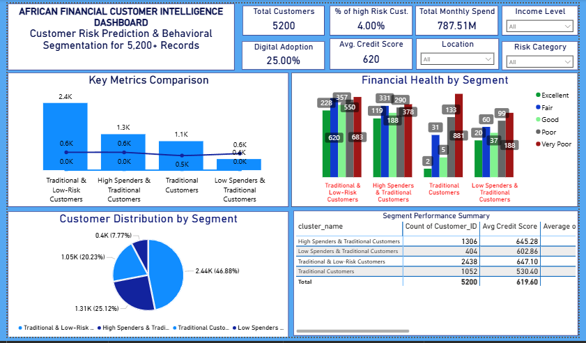
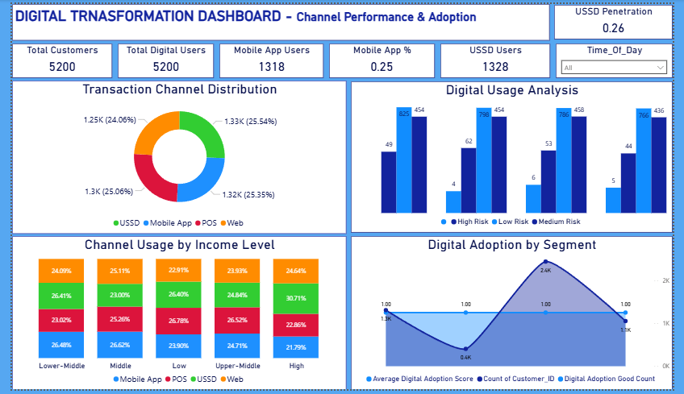
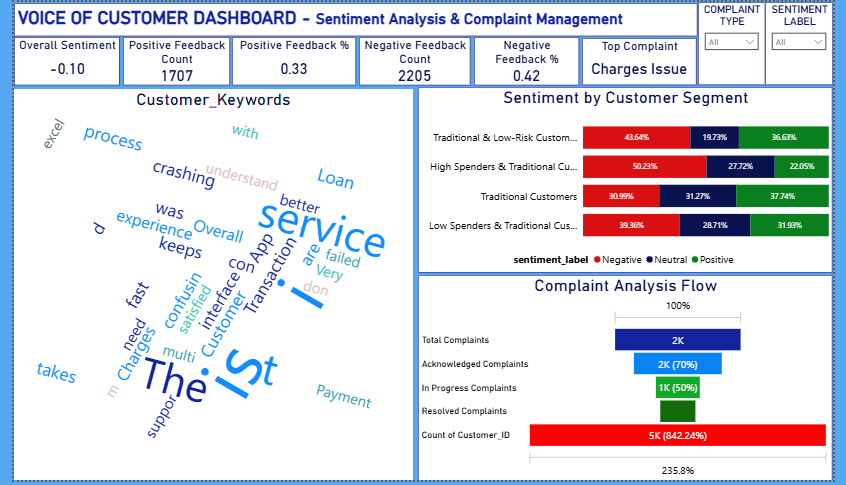
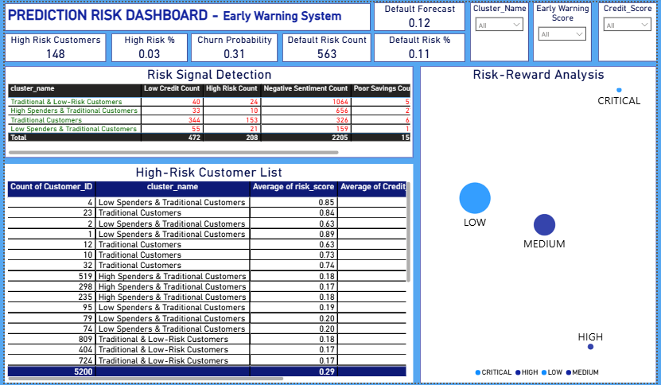

# 🌍 African Financial Customer Intelligence Platform

### Customer Financial Risk Prediction & Sentiment Analysis System

**Domain:** African Financial Markets Analytics
**Program:** [DataVerse Africa Internship Cohort 3.0](https://dataverseafrica.org/) — Data Analytics Track
**Duration:** 12 Weeks (Training + Project-Based)
**Team:** Amarachi Florence, Thato Maelane, Philip Odiachi, Mavis


---

##  Project Overview

The **African Financial Customer Intelligence Platform** is an end-to-end analytics solution developed to help financial institutions in Africa better understand customer behavior, assess financial risk, and derive insights that drive real operational improvements. The platform combines machine learning, sentiment analysis, interactive web analytics, and executive reporting into one unified analytics ecosystem.

The system was validated using **5,200+ real customer records**, while also being engineered with adaptive intelligence that allows users to upload **any financial dataset** and automatically generate structured analytics and business-ready insights.

---

## 🌐 Live Platforms & Resources

 **Streamlit Interactive App (Flexible Analytics):**
[https://african-financial-risk-dashboard-d.streamlit.app/](https://african-financial-risk-dashboard-d.streamlit.app/)

 **Power BI Executive Dashboard Suite (Production Insights):**
[https://bit.ly/45za0YJ](https://bit.ly/45za0YJ)

 **Project Report (Presentation):**
[https://docs.google.com/presentation/d/1JN4UVYeWbU-VgZt-d_Dew5ne6vzgucit/edit](https://docs.google.com/presentation/d/1JN4UVYeWbU-VgZt-d_Dew5ne6vzgucit/edit)

🌐 **DataVerse Africa – Internship & Community:**
[https://dataverseafrica.org/](https://dataverseafrica.org/)

---

##  Core Capabilities

* Automated customer segmentation using clustering algorithms
* Predictive financial risk scoring
* Sentiment analysis on customer feedback using NLP
* Digital channel adoption insights
* Interactive visual analytics dashboards
* Downloadable analytical outputs
* Business recommendations directly tied to insights

---

##  How to Run Locally

```bash
pip install -r requirements.txt
python -m streamlit run streamlit_app.py
```

---

# 📊 Power BI Executive Dashboard Suite

Below are insights from the six executive dashboards built using the fixed 5,200-record dataset.

---

## 🔹 Dashboard 1 — Customer Risk Overview



This dashboard provides a high-level view of the overall customer base, segmented by financial risk levels and key credit indicators. It highlights the distribution of customers across risk bands and reveals the concentration of higher-risk profiles within specific behavioral segments.

**Key Findings:**
A significant share of customers fall into elevated risk categories, indicating exposure within parts of the loan portfolio and a need for structured monitoring mechanisms.

**Business Insight:**
Risk concentration suggests that proactive financial education and monitoring strategies are necessary to stabilize portfolio performance.

**Recommendations:**
Introduce early warning systems, targeted financial literacy programs, and customized credit support plans for vulnerable customer segments.

---

## 🔹 Dashboard 2 — Customer Segments Analysis


This dashboard explores how customer segments differ across demographic, geographic, and behavioral characteristics. It highlights regional patterns and identifies urban centers as hubs of higher-value financial activity.

**Key Findings:**
Spending behavior, product usage, and engagement levels vary widely across segments, with urban customers showing stronger transaction volumes and digital interaction.

**Business Insight:**
Segment diversity presents opportunities for personalized product offerings and region-specific engagement strategies.

**Recommendations:**
Adopt segment-driven marketing, tailor financial products to lifestyle patterns, and focus growth strategies on high-value geographic clusters.

---

## 🔹 Dashboard 3 — Digital Transformation Insights



This dashboard tracks mobile application adoption, digital engagement levels, and transaction channel preferences among customers.

**Key Findings:**
Digital adoption remains relatively low compared to traditional banking channels, indicating room for digital transformation.

**Business Insight:**
Improving digital usage can reduce operational costs while enhancing customer convenience and scalability.

**Recommendations:**
Launch digital onboarding campaigns, provide app usage incentives, and simplify digital interfaces to encourage adoption.

---

## 🔹 Dashboard 4 — Financial Health Metrics


This dashboard presents the distribution of credit scores and provides insight into the overall loan portfolio performance and customer financial stability.

**Key Findings:**
A large proportion of customers fall within low-to-mid credit score ranges, directly influencing lending risk levels.

**Business Insight:**
Customer financial health is closely tied to portfolio performance and long-term revenue sustainability.

**Recommendations:**
Develop credit-building programs, flexible repayment structures, and financial wellness education initiatives.

---

## 🔹 Dashboard 5 — Voice of Customer (Sentiment Analysis)



This dashboard visualizes customer feedback sentiment derived from NLP analysis and highlights key service-related themes.

**Key Findings:**
Negative sentiment clusters around service reliability and technical experience issues.

**Business Insight:**
Customer experience challenges can directly affect retention and brand trust.

**Recommendations:**
Strengthen service support systems, implement structured complaint resolution workflows, and continuously monitor sentiment trends.

---

## 🔹 Dashboard 6 — Prediction Risk Monitoring



This dashboard focuses on identifying customers with elevated default probabilities using predictive analytics models.

**Key Findings:**
A defined subset of customers exhibits strong risk signals requiring immediate attention.

**Business Insight:**
Early identification enables preemptive interventions that minimize financial losses.

**Recommendations:**
Deploy proactive outreach programs and dynamic risk monitoring systems for high-risk customers.

---

##  Streamlit App – Features

The Streamlit application allows users to upload their own datasets and automatically:

* Detect key columns and metadata
* Clean and preprocess data intelligently
* Run segmentation and risk prediction models
* Perform sentiment analysis on feedback text
* Generate interactive charts and summaries
* Export analytical results

Supported input formats: **CSV** and **Excel**.

---

##  Installation & Setup

```bash
git clone https://github.com/YOUR_USERNAME/YOUR_REPO_NAME.git
cd YOUR_REPO_NAME
pip install -r requirements.txt
python -m streamlit run streamlit_app.py
```

---

##  Report & Presentation

Full Project Report:
[https://docs.google.com/presentation/d/1JN4UVYeWbU-VgZt-d_Dew5ne6vzgucit/edit](https://docs.google.com/presentation/d/1JN4UVYeWbU-VgZt-d_Dew5ne6vzgucit/edit)

---

##  Acknowledgments

This project was completed under the **DataVerse Africa Internship Program**. Appreciation goes to mentors, program coordinators, and the data community supporting applied analytics across Africa.

---

##  License

Licensed under the MIT License.
